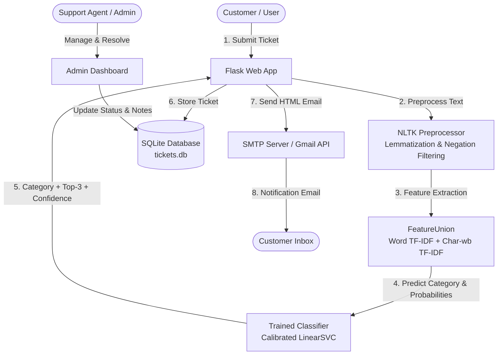

# TicketAI - Intelligent Customer Support Ticket Classification & Automation Platform


**TicketAI** is an end-to-end AI-powered customer support ticketing and automated classification system. It combines modern Natural Language Processing (NLP) with a full-stack Flask web application to automatically classify, prioritize, and route customer support tickets, providing real-time category predictions, calibrated confidence scores, and automated email notifications.

---

## 🌟 Key Features

### 🧠 Machine Learning & NLP Classification Engine
- **Automated Categorization**: Real-time classification into 5 core operational categories:
  - 🛠️ **Technical Support**: Login issues, 500/404 server errors, software bugs, app crashes, connectivity.
  - 💳 **Billing**: Invoices, duplicate charges, payment failures, subscription renewals.
  - 📦 **Returns**: Return requests, damaged goods, incorrect shipments, refunds.
  - ℹ️ **General Inquiry**: Store hours, contact information, product specifications, shipping estimates.
  - ⚠️ **Complaint**: Service dissatisfaction, delivery delays, rude staff, executive escalations.
- **Dual-Granularity Feature Extraction**:
  - **Word-Level TF-IDF (1–2 n-grams)** with sublinear frequency scaling to capture phrases and intent.
  - **Character-Level TF-IDF (3–5 n-grams)** (`char_wb`) to robustly handle typos, misspellings, and morphological variants.
- **Calibrated Probabilistic Inference**:
  - Calibrated probability estimates outputting overall confidence (*High, Medium, Low*).
  - **Top-3 Ranked Predictions**: Transparent multi-category suggestions with probability breakdown.
- **High Accuracy & Generalization**:
  - Evaluated on **8,989 annotated customer support tickets**, achieving **97.89% test accuracy**, **0.979 weighted F1-score**, and **100% precision on real-world edge cases**.

### 💻 Full-Stack Web Application
- **Customer Portal**:
  - Intuitive ticket submission interface with live AI classification preview.
  - Ticket history tracking, status badges, and resolution notes.
- **Administrative Dashboard**:
  - Role-Based Access Control (RBAC) separating regular users and support agents.
  - Real-time ticket statistics (Total, Open, Resolved, Breakdown by Category).
  - Filter tickets by status (*Open, In Progress, Resolved*) and category.
  - Resolution workflow: Add resolution notes, resolve tickets, and trigger automated resolution emails.
- **Automated Transactional Emails**:
  - SMTP/MIME integration with responsive HTML email templates.
  - Instant confirmation upon ticket creation with AI classification badge and confidence score.
  - Resolution notification email delivering the resolution summary to the customer.

---

## 🏗️ System Architecture



---

## 📁 Project Structure

```text
ai_ticket/
├── app.py                                        # Main Flask application (routes, auth, APIs, email)
├── requirements.txt                              # Python dependencies
├── tickets.db                                    # SQLite database (users, tickets, settings)
├── download.py                                   # NLTK resource downloader (stopwords, wordnet)
├── templates/                                    # Jinja2 HTML templates
│   ├── landing.html                              # Public landing page
│   ├── index.html                                # Customer ticket creation & live AI preview
│   ├── dashboard.html                            # User ticket history & dashboard
│   ├── admin_dashboard.html                      # Support agent admin management portal
│   ├── login.html                                # Authentication login page
│   └── register.html                             # User registration page
├── models/                                       # Machine learning models & training pipeline
│   ├── customer_support_tickets.csv              # Comprehensive dataset (8,989 tickets)
│   ├── train_model.py                            # Complete training, benchmarking & serialization script
│   ├── ticket_classification_updated.ipynb       # Interactive Jupyter notebook
│   ├── enhanced_ticket_classifier.joblib         # Production serialized pipeline
│   ├── enhanced_customer_support_model_90plus.pkl# Serialized 90%+ model artifact
│   └── enhanced_model_metadata.json              # Model metrics, per-class stats & metadata
└── documentation/                                # Academic papers, presentations & research docs
```

---

## ⚙️ Installation & Setup

### Prerequisites
- Python 3.10, 3.11, 3.12, or 3.13
- Git

### 1. Clone the Repository
```bash
git clone https://github.com/irfan-shekh/ai_ticket.git
cd ai_ticket
```

### 2. Create and Activate a Virtual Environment
**Windows (PowerShell):**
```powershell
python -m venv env
.\env\Scripts\Activate.ps1
```

**macOS / Linux:**
```bash
python3 -m venv env
source env/bin/activate
```

### 3. Install Dependencies
```bash
pip install -r requirements.txt
```

### 4. Download Required NLTK Corpora
```bash
python download.py
```

### 5. Configure Email Credentials (Optional)
To enable real email dispatch, configure your SMTP settings in [app.py](app.py) or set environment variables:
```python
app.config['SMTP_SERVER'] = 'smtp.gmail.com'
app.config['SMTP_PORT'] = 587
app.config['EMAIL_USER'] = 'your-email@gmail.com'
app.config['EMAIL_PASSWORD'] = 'your-gmail-app-password'
```

---

## 🚀 Running the Application

Start the Flask development server:
```bash
python app.py
```

Open your browser and navigate to:
```text
http://127.0.0.1:5000
```

### Default Credentials
| Role | Username | Password |
| :--- | :--- | :--- |
| **Admin** | `admin` | `admin123` |
| **Demo User** | `demo` | Register a new account on `/register` |

---

## 🧪 Model Training & Retraining

To train or retrain the enhanced classification pipeline:

```bash
python models/train_model.py
```

This script will:
1. Ingest `models/customer_support_tickets.csv` (8,989 labeled samples).
2. Apply word & sub-word n-gram feature extraction.
3. Train and benchmark candidate algorithms with **Calibrated LinearSVC**.
4. Output classification reports, precision, recall, and confusion matrices.
5. Export production models to `models/enhanced_ticket_classifier.joblib` and `models/enhanced_customer_support_model_90plus.pkl`.
6. Update `models/enhanced_model_metadata.json` with current performance figures.

You can also run [models/ticket_classification_updated.ipynb](models/ticket_classification_updated.ipynb) interactively in Jupyter or Google Colab.

---

## 📡 REST API Reference

### `POST /classify`
Submits a ticket description for automated AI classification and storage.

* **Headers**: `Content-Type: application/json`
* **Authentication**: Requires active user session

#### Request Body
```json
{
  "ticket_text": "I was charged twice on my credit card for invoice #INV-4820",
  "notification_email": "customer@example.com"
}
```

#### Response (`200 OK`)
```json
{
  "category": "Billing",
  "confidence": 98.0,
  "confidence_level": "High",
  "top_predictions": [
    {"category": "Billing", "confidence": 98.0},
    {"category": "Complaint", "confidence": 0.97},
    {"category": "Returns", "confidence": 0.53}
  ],
  "description": "Payment issues, invoices, billing questions, and subscription renewals",
  "ticket_id": 14,
  "email_sent": true,
  "success": true
}
```

---

## 📊 Benchmark Results (Enhanced Model)

Evaluated on the full 8,989-sample dataset with a test partition:

| Category | Precision | Recall | F1-Score | Support |
| :--- | :---: | :---: | :---: | :---: |
| **Technical Support** | **0.99** | **0.99** | **0.99** | 971 |
| **General Inquiry** | **0.98** | **0.97** | **0.97** | 338 |
| **Returns** | **0.97** | **0.97** | **0.97** | 135 |
| **Complaint** | **0.97** | **0.94** | **0.96** | 229 |
| **Billing** | **0.93** | **0.97** | **0.95** | 125 |
| **Overall Accuracy** | — | — | **97.89%** | **1,798 test samples** |
| **Weighted F1-Score**| — | — | **0.979** | — |
| **Macro F1-Score**   | — | — | **0.968** | — |

---

## 📄 License
This project is licensed under the MIT License - see the LICENSE file for details.
